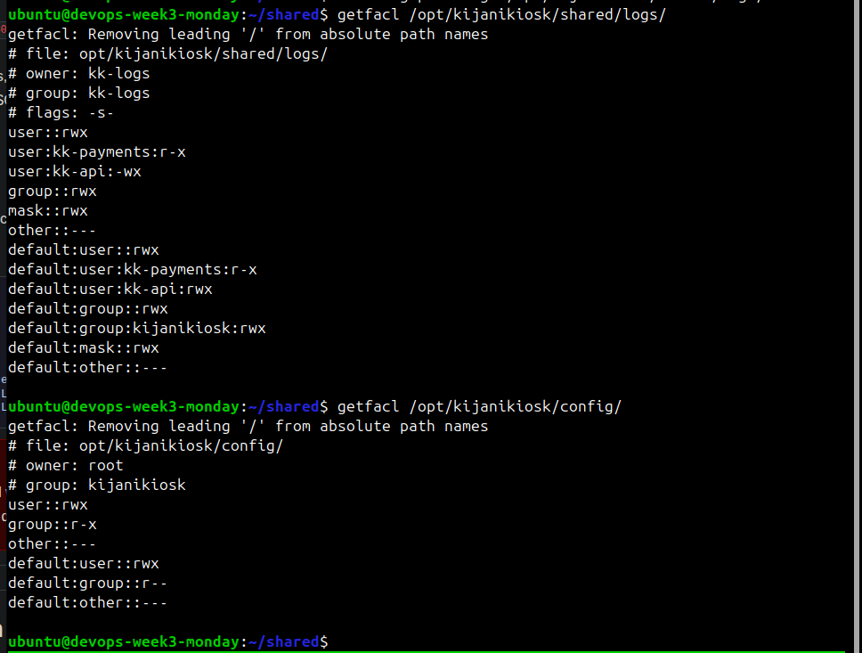
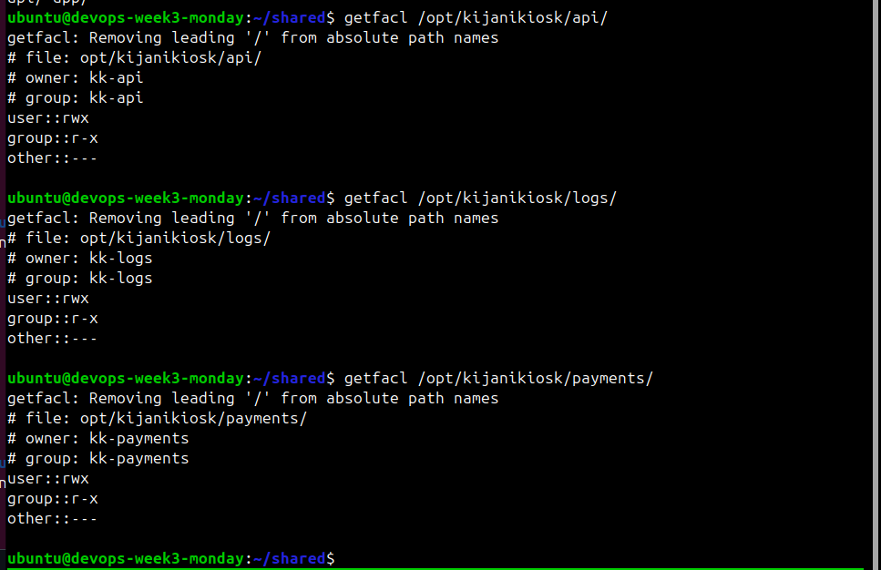

# KijaniKiosk Access Model Design (Final)

## 1. Full Access Design Table

| Path                            | Owner         | Group         | Mode                         | Special Bits | ACL Exceptions                                                               | Purpose                                                      |
| :------------------------------ | :------------ | :------------ | :--------------------------- | :----------- | :--------------------------------------------------------------------------- | :----------------------------------------------------------- |
| `/opt/kijanikiosk/api/`         | `kk-api`      | `kk-api`      | `750`                        | None         | None                                                                         | Isolated runtime for API service.                            |
| `/opt/kijanikiosk/payments/`    | `kk-payments` | `kk-payments` | `750`                        | None         | None                                                                         | Isolated runtime for Payments service.                       |
| `/opt/kijanikiosk/logs/`        | `kk-logs`     | `kk-logs`     | `750`                        | None         | None                                                                         | Isolated storage for local log processing.                   |
| `/opt/kijanikiosk/config/`      | `root`        | `kijanikiosk` | `750` (dir) `640` (files) | None         | `ubuntu`: `r-x` (dir) `ubuntu`: `r--` (files)                             | Centralized config managed by root, readable by ops.         |
| `/opt/kijanikiosk/shared/logs/` | `kk-logs`     | `kk-logs`     | `2770`                       | **SGID**     | `kk-api`: `wx` `kk-payments`: `rx` `ubuntu`: `rx`                      | Shared log aggregation zone with enforced group inheritance. |
| `/opt/kijanikiosk/health/`      | `root`        | `kijanikiosk` | `750` (dir) `640` (files) | None         | Default ACL: group `r--` `ubuntu`: `r-x` (dir) `ubuntu`: `r--` (files) | Health check output readable by monitoring and ops.          |

---

## 2. Design Reasoning

### A. Ownership Strategy (Why this owner/group?)

* **Service Isolation (`kk-api:kk-api`, etc.):**
  Each service directory remains owned by its respective service account and group. This enforces strict isolation: a compromised service cannot modify or access another service’s runtime data.

* **Config Ownership (`root:kijanikiosk`):**
  Configuration remains owned by `root` to prevent tampering by services. The shared `kijanikiosk` group allows controlled read access for operators.

* **Shared Logs Ownership (`kk-logs:kk-logs`):**
  The logging service owns the aggregation directory to maintain full control over log lifecycle operations such as rotation and cleanup.

* **Health Directory (`root:kijanikiosk`):**
  The health directory is written by the provisioning process (running as root) but must be readable by monitoring systems and operators. Assigning it to `root:kijanikiosk` ensures integrity (no service can modify it) while allowing controlled read access via group membership.

---

### B. Permission Modes (Why this mode?)

* **`750` for Service Directories:**
  Maintains strict isolation while allowing controlled traversal by group members.

* **`640` for Sensitive Files (Config & Health):**
  Prevents unauthorized modification while allowing read access where necessary.

* **`2770` for Shared Logs (SGID):**
  Ensures all files inherit the `kk-logs` group, which is critical for consistent access across services and for log processing.

* **Health Directory Permissions:**
  Mirrors the config model: writable only by root, readable by group. This ensures monitoring visibility without exposing the file system broadly.

---

### C. ACL vs. Basic Permissions (Why ACLs?)

ACLs remain necessary to achieve fine-grained access control:

1. **Cross-Service Logging Access:**

   * `kk-api` requires write access to `/shared/logs/` without gaining broader group privileges.
   * ACL (`u:kk-api:wx`) enables this without modifying group membership.

2. **Operator Access (`ubuntu` user):**

   * Needs read access to config, shared logs, and now health data.
   * ACLs grant targeted `rx`/`r--` access without overexposing other directories.

3. **Health Directory Defaults:**

   * The provisioning script creates files as root.
   * Default ACLs ensure all new files automatically inherit group-readable permissions (`r--`) without requiring manual chmod after each write.

4. **Mask Enforcement:**

   * Default ACL masks ensure files adhere to `640` even if system `umask` differs.
   * This guarantees consistency across all created files.

---

### D. Logrotate Interaction Notes

The `/opt/kijanikiosk/shared/logs/` directory is managed by the `kk-logs` service and is subject to log rotation.

* **Ownership & Permissions:**
  Because the directory is owned by `kk-logs` with SGID enabled, rotated files retain the correct group ownership (`kk-logs`). This ensures continued accessibility for all services relying on shared logs.

* **logrotate Execution Context:**
  `logrotate` runs as root, which allows it to rotate files regardless of ownership restrictions.

* **Post-Rotation Behavior:**
  After rotation, the `kk-logs` service is restarted via `systemctl restart`. This ensures file descriptors are reopened and logging continues correctly.

* **Security Implication:**
  No additional permissions are required for logrotate, and no service-level privilege escalation is introduced. The design maintains strict separation while allowing controlled operational behavior.

---

## 3. Security Summary

* **Isolation:**
  Services cannot interfere with each other’s runtime environments.

* **Integrity:**
  Critical data (config and health outputs) are root-owned and immutable by services.

* **Controlled Sharing:**
  SGID and ACLs enable collaboration (logs, monitoring) without breaking isolation.

* **Operational Visibility:**
  Monitoring systems and operators can read necessary data (logs, configs, health) without requiring elevated privileges.

* **Consistency:**
  Default ACLs ensure that all newly created files adhere to the defined access model automatically.

This final model extends the original design to include monitoring outputs and log lifecycle management without compromising security principles.

Screenshots of all four key directories (`/opt/kijanikiosk/api/`, `/opt/kijanikiosk/payments/`, `/opt/kijanikiosk/logs/`, and `/opt/kijanikiosk/config/`):

