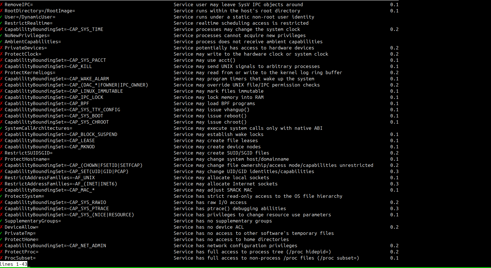
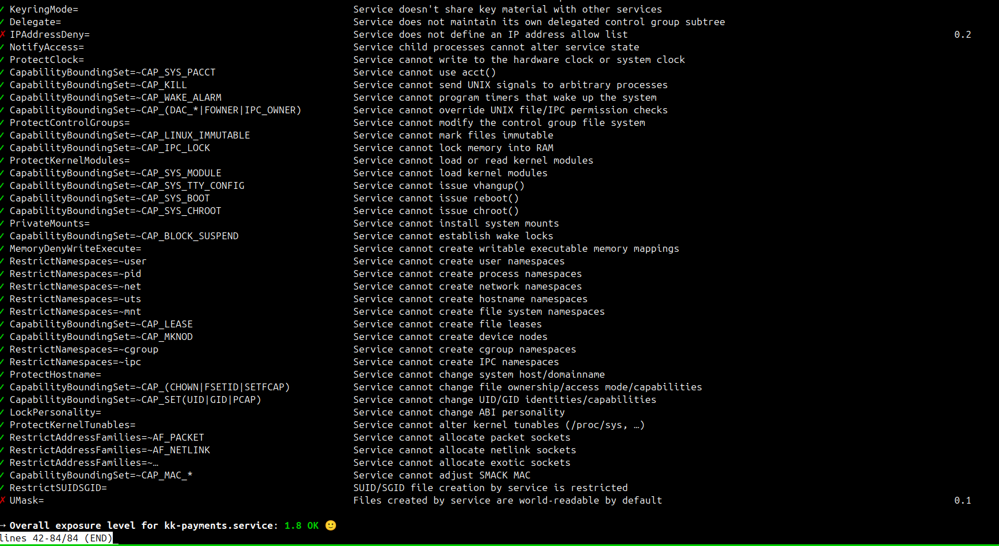

Before hardening, the system is in a vulnerable state. The following screenshot illustrates the system's status prior to implementing security measures.
Exposure level was at 6.5

After hardening, the system is configured with improved security controls and reduced attack surface.
Exposure level was reduced to 1.8

